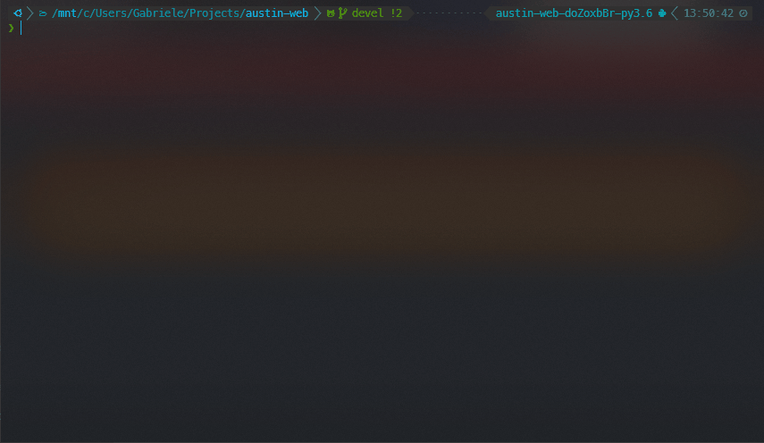

   
  
   

<h3 align="center">A Modern Web Interface for Austin</h3>

  
  &nbsp;&nbsp;&nbsp;&nbsp;
  
  &nbsp;&nbsp;&nbsp;&nbsp;
  

  
  
  
  
  

  <a href="#synopsis"><b>Synopsis</b></a>&nbsp;&bull;
  <a href="#installation"><b>Installation</b></a>&nbsp;&bull;
  <a href="#usage"><b>Usage</b></a>&nbsp;&bull;
  <a href="#compatibility"><b>Compatibility</b></a>&nbsp;&bull;
  <a href="#contribute"><b>Contribute</b></a>

  

# Synopsis

Austin Web is a modern web interface for Austin, based on
[D3.js](https://d3js.org/) and [tailwindcss](https://tailwindcss.com/). It is
yet another example of how to use Austin to make a visual profiling tool for
Python. The flame graph is generated using
[d3-flame-graph](https://github.com/spiermar/d3-flame-graph).

  

Austin Web offers two main functionalities. The default one is to serve a web
page that allows you to have a live view of the metrics collected by Austin. The
visualisation is a _live_ flame graph in your browser that refreshes every 3
seconds with newly collected data. Hence, Austin Web can also be used for
_remote_ profiling.

You can also run Austin Web in _compile_ mode to generate a static flame graph
HTML page, much like
[flamegraph.pl](https://github.com/brendangregg/FlameGraph), but with the full
Austin Web UI around it.

# Installation

Austin Web can be installed from PyPI simply with

~~~ bash
pip install austin-web
~~~

> **NOTE** Austin Web relies on the
> [Austin](https://github.com/P403n1x87/austin) binary being available from the
> `PATH` environment variable. So make sure that Austin is properly installed on
> your system. See
> [Austin installation](https://github.com/P403n1x87/austin#installation)
> instruction for more details on how to get Austin installed on your platform.

# Usage

You can run Austin Web simply with

~~~ bash
austin-web python3 myscript.py
~~~

to start serving on localhost over an ephemeral port. If `myscript.py` is an
executable script, you can simply do

~~~ bash
austin-web myscript.py
~~~

If you want to specify the host and the port, you can pass the `--host` and
`--port` options to the command line. For example, to serve for the World on
port 5050, use

~~~ bash
austin-web --host 0.0.0.0 --port 5050 python3 myscript.py
~~~

If you want to compile the collected metrics into a static HTML page, you can
run Austin Web in compile mode by passing the `--compile` option, followed by
the destination file name, e.g.

~~~ bash
austin-web --compile output.html python3 myscript.py
~~~

Like Austin, you can use Austin Web to profile any running Python application.
For example, to profile a WSGI server and all its child processes, get hold of
its PID and do

~~~ bash
sudo austin-web -Cp <pid>
~~~

# Compatibility

Austin Web has been tested with Python 3.6-3.9 and is known to work on
**Linux**, **MacOS** and **Windows**.

Austin Web is known to have some minor issues on Windows. When started in serve
mode, pressing `Ctrl+C` might not actually stop Austin Web.

Since Austin Web uses Austin to collect samples, the same note applies here:

> Due to the **System Integrity Protection** introduced in **MacOS** with El
> Capitan, Austin cannot profile Python processes that use an executable located
> in the `/bin` folder, even with `sudo`. Hence, either run the interpreter from
> a virtual environment or use a Python interpreter that is installed in, e.g.,
> `/Applications` or via `brew` with the default prefix (`/usr/local`). Even in
> these cases, though, the use of `sudo` is required.

# Contribute

If you want to help with the development, then have a look at the open issues
and have a look at the [contributing guidelines](CONTRIBUTING.md) before you
open a pull request.

You can also contribute to the development of the Austin Web by becoming a
sponsor and/or by [buying me a coffee](https://www.buymeacoffee.com/Q9C1Hnm28)
on BMC or by chipping in a few pennies on
[PayPal.Me](https://www.paypal.me/gtornetta/1).

  

